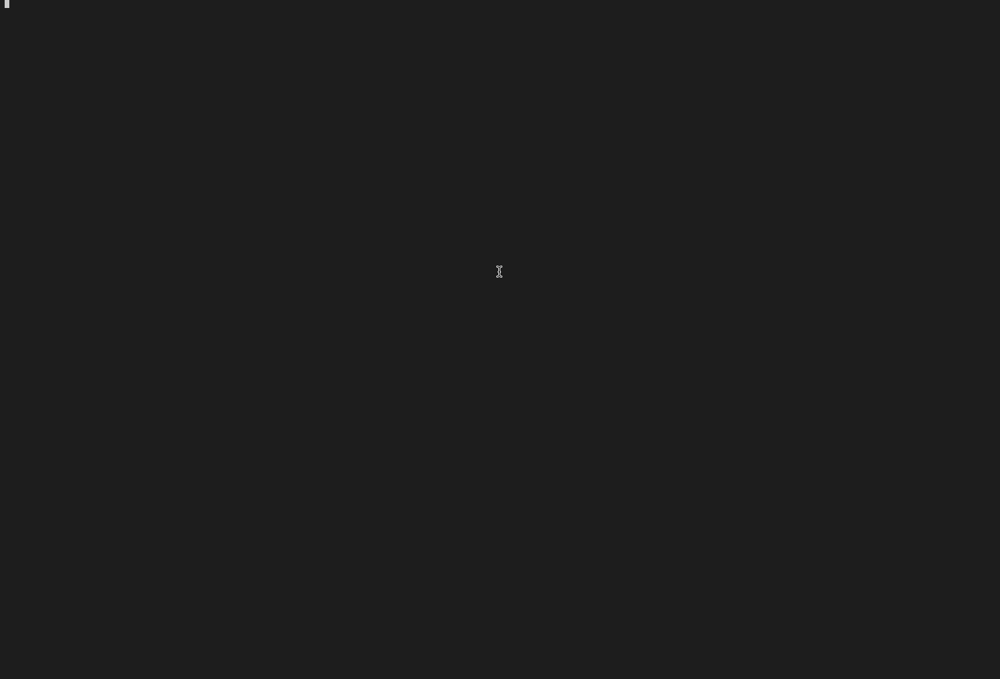

# AI News Summary Agent

## 1. Introduction

This is a lightweight Python-based AI agent that searches for the latest news from any news domain, reads the articles and generates a concise daily news summary using an LLM. Currently, I'm using **gpt-4.1-nano** model for the summarizing. The agent framework I'm using is [smolagents](https://github.com/huggingface/smolagents).

The reason for building this agent is to get a daily news summary 2x a day to my email, if I'm too busy to actually read the news. This is surprisingly difficult to do with the basic LLM models today via the chat UIs. Often, they will not provide the latest news, will hallucinate news pieces or just get blocked by the news sites. I'm sure future agentic models like the [Operator](https://openai.com/index/introducing-operator/) will fix this, but meanwhile, why not code my own solution.

The original template used to build this agent was kindly provided by [Hugging Face](https://huggingface.co/spaces/agents-course/First_agent_template).

## 2. Main Features

When executing the tool manually, it asks for a news website domain url from the user (for example, [hs.fi](https://hs.fi), [yle.fi](https://yle.fi), [bbc.com](https://bbc.com), [nytimes.com](https://nytimes.com), [reuters.com](https://reuters.com) or any other major news outlet that can be used by the [newsdata.io API](https://newsdata.io/)) and as an output, returns an approximately 125-word long daily news analysis for the user.

Under the hood, the agent independently uses **3 separate tools** that it has access to:

- **Tool #1**: Fetches the latest news headlines and their urls using newsdata.io API
- **Tool #2**: Scrapes the actual news article content with newspaper3k/BeautifulSoup -libraries
- **Tool #3**: Summarizes each article and stores it into a list of dictionaries

After using the tools, the agent provides one combined, final summary of all the extracted news articles, which is approximately 125 words long. The summarizing behavior can be fined-tuned by altering the user query used in main.py. For example, currently I'm instructing the agent to emphasize technology, AI and business -related news and providing concise summaries.

Example of manual usage from the command line:
\
\

\
\
Besides manual usage, I still want to add scheduling, so that the agent could provide the summary via email every morning and afternoon at 8.00 am / 4.00 pm.

## 3. Main Architecture

The basic architecture of the agent is currently as follows:

1. **main.py**  
   - Loads API keys and prompt templates  
   - Instantiates a smolagents CodeAgent with the necessary tools
   - Prompts the user for a news domain and kicks off the agent loop  

2. **Tools**  
   - **news_tools.py**
       - `latest_news(domainurl)`: fetches recent headlines via the NewsData API from the given domainurl
       - `fetch_article_text(url)`: fetches the article texts from the urls
       - `summarize_articles(articles, max_length)`: summarizes the article texts, the model reads at most max_length words for the summary
   - **final_answer.py** → formats and returns the LLM’s news summary 

3. **Agent Loop** (smolagents)  
   - **Think**: LLM plans next step  
   - **Act**: calls `latest_news` to get headlines and urls, `fetch_article_text` to get the full texts or `summarize_articles` to summarize them
   - **Observe**: Observers the result of the latest action
   - **Think**: Plans next step, and so on...
  
## 4. Tech Stack

- **Python**: Main language for the agent and tools. Libraries used include configparser, yaml, requests, json
- **smolagents**: Framework used for the agent itself and its orchestration  
- **LLMs**: OpenAI Python SDK, gpt-4.1-nano model used via the OpenAI API for summary generation

## 5. Project Structure

The project files and folders are structured as shown below. **Note that I have not provided config.ini itself for security reasons**, but this is just a standard config-setup, so it should be quite straightforward to build on your own.

```
ai-agent-news-summary
├── tools/
│   ├── final_answer.py     # Allows the agent to form the final answer
|   ├── news_tools.py       # Contains the tools
|   ├── __init__.py         # This is needed so that the folder is recognized as a package
├── agent.json              # Contains the basic agent definition, including model, tools, prompt_templates, authorized imports
├── config.ini              # Config loader
├── main.py                 # The actual script used to run the agent, mainly contains a basic model and agent definition
├── prompts.yaml            # System prompts that give examples for the agent to help reasoning and break down tasks
├── README.md               # This readme-file
└── requirements.txt        # All libraries and imports needed to run the agent
```
